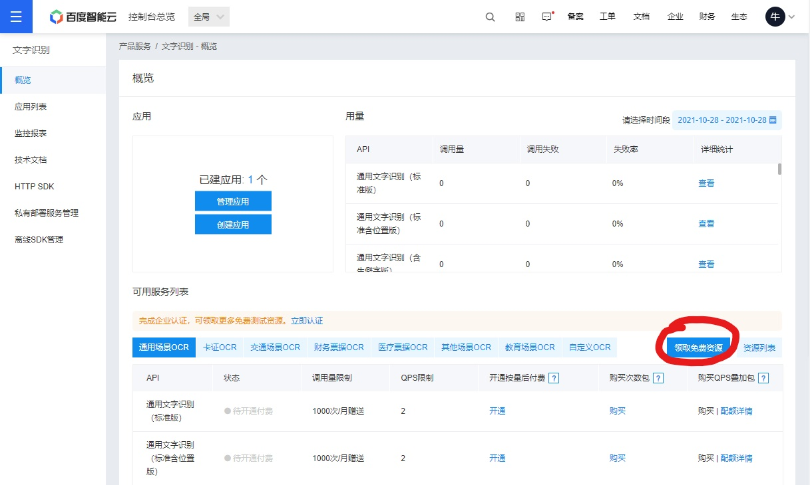
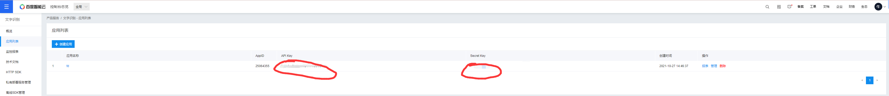

# 平安复旦自动打卡

使用Golang打卡平安复旦并使用qq邮箱推送

---

## 如何使用
首先确保使用go mod模式

```
export GO111MODULE=on
export GOPROXY=https://goproxy.cn
```

1. go get -u github.com/oOlivero/daily_fudan
2. go run daily_fudan
3. 按照提示输入发送打卡推送的邮箱和token
4. 输入账号密码邮箱
5. 输入百度OCRAPI
6. 完成自动打卡接受到邮件


### 打卡推送的qq邮箱
<details>
<summary>查看教程</summary>
打开qq邮箱</br>
https://mail.qq.com/ </br>
qq邮箱中选择邮箱设置->账户

</br>
下翻到如下</br>
</br>
开启pop3/SMTP</br>
再点击下方生成授权码</br>
授权码即为打卡推送的邮箱和token</br>
</details>

---
### 获取百度OCRAPI
<details>
<summary>查看教程</summary>
https://cloud.baidu.com/product/ocr </br>
打开上述网址登陆后再打开</br>
https://console.bce.baidu.com/ai/#/ai/ocr/overview/index

 </br>
点击免费领取资源 </br>
然后选择通用文字识别（高精度版）-------ps.个人认证后，一个月1000次完全够用的

然后点击创建应用随便填一填</br>
完成后如下图API Key和Secret Key就是我们需要的百度的接口密钥

</details>

---
## 说明
- 打卡时使用前一日地理位置信息。
- 打卡前会检测当日是否已打卡，避免重复提交。
- 学校添加了验证码现已更新验证码
- 如需变更打卡位置请提前停止自动打卡，到新位置手动打卡一次再开启（或赶在自动打卡时间前手动打卡）或者可以自己动手改一下要post的json。
- 未经充分测试，不保证最终效果，请酌情使用。
